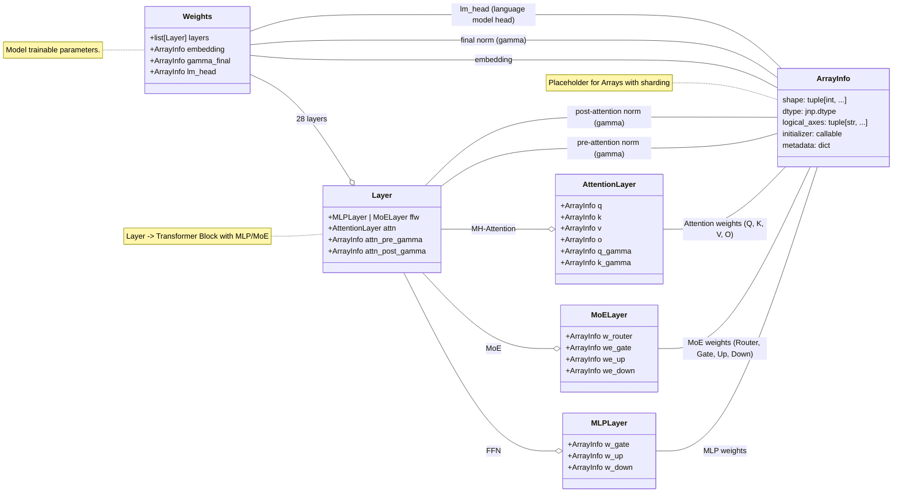

# JLLM
This repository contains pieces of code to run `Qwen3` models (`0.6B, 4B, 8B, 14B`). 

The goal is educacional and uses [llm-examples](https://github.com/jax-ml/jax-llm-examples/tree/main) as reference for the `JAX` implementation of `Qwen3` and `Llama3.1` models; The idea is to have a *simpler* wrapper with instructions to run in Colab resources (v2-8 TPU).

> [!NOTE] 
> The implementation here is *taken from [jax-llm](https://github.com/jax-ml/jax-llm-examples/tree/main)* and does NOT have quantization. The variable/function definitions are more verbose, and it includes `top_p` sampling instead of a greedy one. 
> All credits **MUST** go to the JAX team.


[](https://colab.research.google.com/drive/1NLGltk6abV0OnQ60H2uPmFwYoBfvHqij?usp=sharing)
[](https://www.kaggle.com/code/reidmen/jllm-testing-8b)

## Setup Environment

I strongly recommend using [uv](https://github.com/astral-sh/uv). Then proceed as follows:

```bash
uv venv .venv 
git clone https://github.com/Reidmen/jllm && cd ./jllm && uv pip install . 
```

## Qwen3

Following the open-weighted models from Qwen, this repo contains the architecture 
implementation to run `Qwen3` parameters models.

From its [release-notes](https://qwenlm.github.io/blog/qwen3/), some model characteristics are:

* `Qwen3 0.6B`: 28 Layers, 16 / 8 (Q/KV), with tie embedding and context of 32K
* `Qwen3 8B`, 36 Layers, 32 / 8 (Q/KV), no tie embedding and context of 128K 
* `Qwen3 14B`, 40 Layers, 40 / 8 (Q/K), no tie embedding and context of 128K
* `Qwen3 30B-A3B`, 48 Layers, 32 / 4 (Q/KV), 128T - 8A Experts and context of 128K 


## Example

To run the `Qwen3-4B` model in a Colab instance, simply type:
```bash
!python3 ./jllm/scripts/download_model.py --model-id "Qwen/Qwen3-4B" --dest-path ./hf_models/ 
!python3 ./jllm/scripts/convert_weights.py --hf-model-path ./hf_models/Qwen--Qwen3-4B --jax-model-path ./jax_models/Qwen--Qwen3-4B
```

It will download the `Qwen3 4B` model weights from HuggingFace and convert those weights to a `JAX` compatible format (stored in `./jax_models/`).

Finally, you can run the inference with a default prompt:

```bash
!python3 ./jllm/src/jllm/qwen/main.py --weights-path ./jax_models/Qwen--Qwen3-14B
```

> [!NOTE]
> The default prompt asks three different questions to the LLM
> ```python
>  prompts = [
>      "Tell me a nice phrase of humanity",
>      "Do you like the old english language, why?",
>      "Can you explain in German a phrase connected to German philosophy?",
>    ]
> ```

The type of responses you will get will start with the `<think>` token:

```bash
[Response] (0) <think>
Okay, the user asked for a nice phrase about humanity. Let me think about what they might be looking for. They could want something uplifting, maybe for a speech, a quote, or just to share. I should focus on positive aspects of humanity....

[Response] (1) <think>
Okay, the user is asking if I like the old English language and why. First, I need to clarify that I don't have personal feelings, but I can explain the historical and linguistic significance of Old English. Let me start by defining Old English and its time period. It was spoken from around the 5th to the 11th century, so I should mention the Germanic tribes like the Angles, Saxons, and Jutes. 

[Response] (2) <think>
Okay, the user is asking for an explanation of a phrase connected to German philosophy in German. Let me start by recalling some key German philosophical concepts. Heidegger's "Sein und Zeit" comes to mind, but maybe that's too specific. Alternatively, the phrase "der Mensch ist die Messlatte" (man is the measure) is from Heraclitus, but that's Greek. Wait...
```

You can also provide an extra argument `--user-input` with your extra prompt.
It will be appended to the default ones

```bash
!python3 ./jllm/src/jllm/qwen/main.py --weights-path ./jax_models/Qwen--Qwen3-14B --user-input "Can you write a simple poem of the Spanish heritage in South America?"
```

## Models programatic architecture

Below shows an example of the class inheritance for implementation purposes. 

