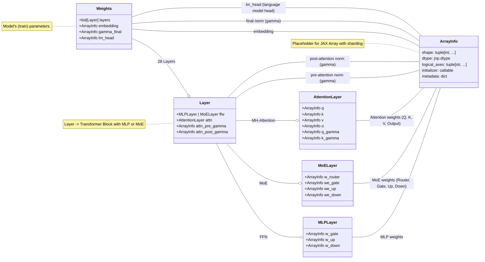

# JLLM
This repository contains pieces of code to run `Qwen3` models (`0.6B, 4B, 8B, 14B`). 

The goal is educational and aims at providing a `JAX` implementation of `Qwen` and `Llama` models powerful enough to use all Colab resources (v2-8 TPU).

> [!NOTE] 
> This repository is strongly based on (jax-llm-exampled)[https://github.com/jax-ml/jax-llm-examples/tree/main].
> The models implemented here do NOT have quantization (yet), and variable/function definitions more verbose.
> All credits MUST go to the JAX team.

## Setup Environment

I strongly recommend using `uv`. Then proceed as follows:

```bash
uv venv .venv 
uv pip install . 
```


## Qwen3

Following the open-weighted models from Qwen, this repo contains the architecture 
implementation to run Qwen3-0.6B parameters model.

From its [release-notes](https://qwenlm.github.io/blog/qwen3/), the model characteristics are:

* Qwen3-0.6B, 28 Layers, 16 / 8 Heads (Q / KV), with tie embedding, and a context 
length of 32K. 

To run in Colab instance, simply type:
```bash
!python3 ./jllm/scripts/download_model.py --model-id "Qwen/Qwen3-0.6B" --dest-path ./hf_models/ 
!python3 ./jllm/scripts/convert_weights.py --hf_model_path ./hf_models/Qwen--Qwen3-0.6B --jax_model_path ./jax_models/Qwen--Qwen3-0.6B
```

It will download the `Qwen 0.6B` model weights from HuggingFace, save them to `./hf_models/Qwen--Qwen3-0.6B` and finally convert those weights to a `JAX` compatible format.    


## Models programatic architecture

Below shows an example of the class inheritance for implementation purposes. 

