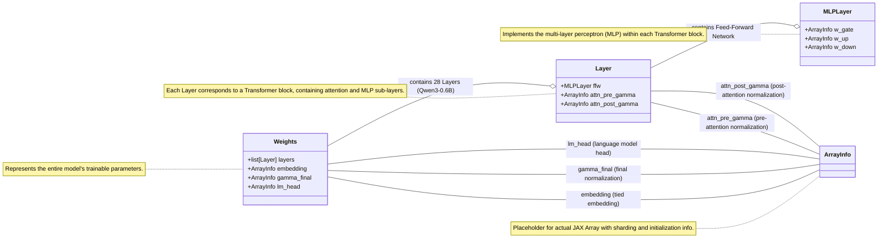

# JLLM
This repository contains pieces of code to run `Llama-3.2-1B` or `Qwen3-0.6B`. 

The goal is educational and aims at providing a `JAX` implementation of each architecture component.


## Setup Environment

I strongly recommend using `uv`. Then proceed as follows:

```bash
uv venv .venv 
uv pip install . 
```


## Qwen3-0.6B

Following the open-weighted models from Qwen, this repo contains the architecture 
implementation to run Qwen3-0.6B parameters model.

From its [release-notes](https://qwenlm.github.io/blog/qwen3/), the model characteristics are:

* Qwen3-0.6B, 28 Layers, 16 / 8 Heads (Q / KV), with tie embedding, and a context 
length of 32K. 

TODO: THE GOAL FOR THIS IS TO RUN IN COLAB / KAGGLE 

## Models programatic architecture

Below shows an example of the class inheritance for implementation purposes. 

