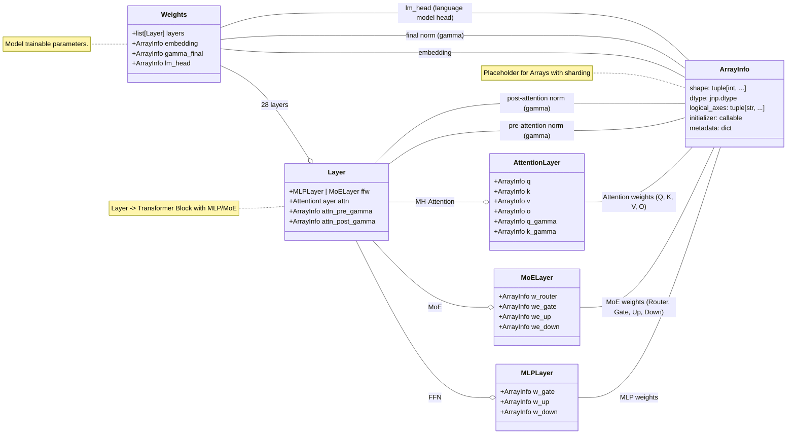

# JLLM
This repository contains pieces of code to run `Qwen3` models (`0.6B, 4B, 8B, 14B`). 

The goal is educacional and uses [jax-llm-examples](https://github.com/jax-ml/jax-llm-examples/tree/main) as reference for the `JAX` implementation of `Qwen3` and `Llama` models; The idea is to have a *simpler* wrapper with instructions to run with Colab resources (v2-8 TPU).

> [!NOTE] 
> This repository is *fully* based on [jax-llm-examples](https://github.com/jax-ml/jax-llm-examples/tree/main).
> The implementation here is a *simplification* and does NOT have quantization (yet). The variable/function definitions are more verbose.
> All credits **MUST** go to the JAX team.

## Setup Environment

I strongly recommend using [uv](https://github.com/astral-sh/uv). Then proceed as follows:

```bash
uv venv .venv 
git clone https://github.com/Reidmen/jllm && cd ./jllm && uv pip install . 
```

## Qwen3

Following the open-weighted models from Qwen, this repo contains the architecture 
implementation to run `Qwen3 0.6B` parameters model.

From its [release-notes](https://qwenlm.github.io/blog/qwen3/), some model characteristics are:

* `Qwen3 0.6B`: 28 Layers, 16 / 8 (Q/KV), with tie embedding and context of 32K
* `Qwen3 8B`, 36 Layers, 32 / 8 (Q/KV), no tie embedding and context of 128K 
* `Qwen3 14B`, 40 Layers, 40 / 8 (Q/K), no tie embedding and context of 128K
* `Qwen3 30B-A3B`, 48 Layers, 32 / 4 (Q/KV), 128T - 8A Experts and context of 128K 


To run the `Qwen3-0.6B` model in a Colab instance, simply type:
```bash
!python3 ./jllm/scripts/download_model.py --model-id "Qwen/Qwen3-0.6B" --dest-path ./hf_models/ 
!python3 ./jllm/scripts/convert_weights.py --hf_model_path ./hf_models/Qwen--Qwen3-0.6B --jax_model_path ./jax_models/Qwen--Qwen3-0.6B
```

It will download the `Qwen3 0.6B` model weights from HuggingFace, save them to `./hf_models/Qwen--Qwen3-0.6B` and finally convert those weights to a `JAX` compatible format.


## Models programatic architecture

Below shows an example of the class inheritance for implementation purposes. 

